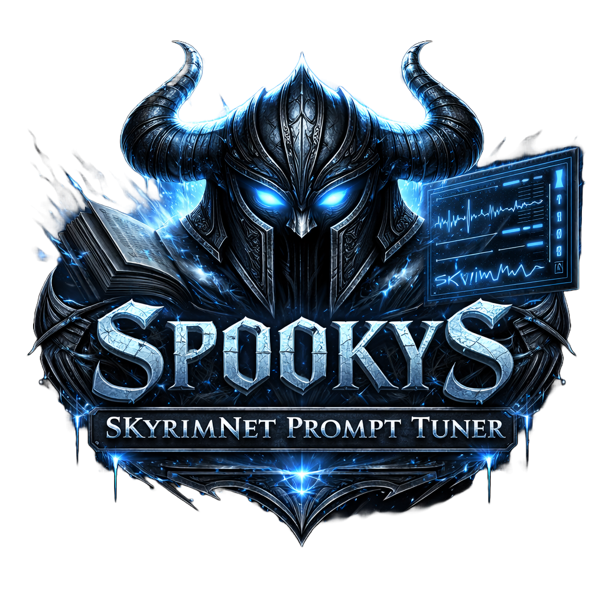
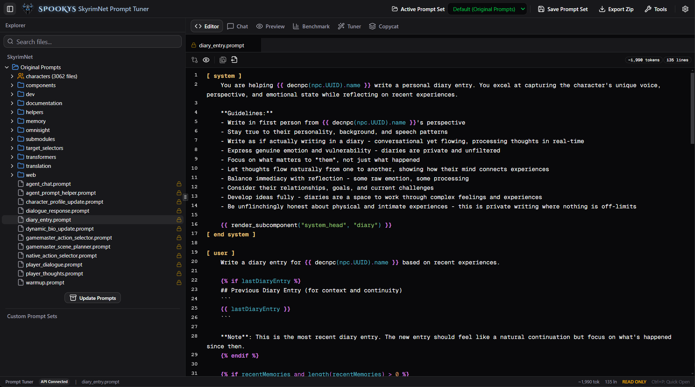
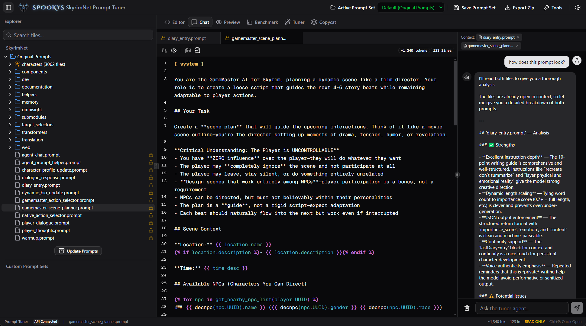
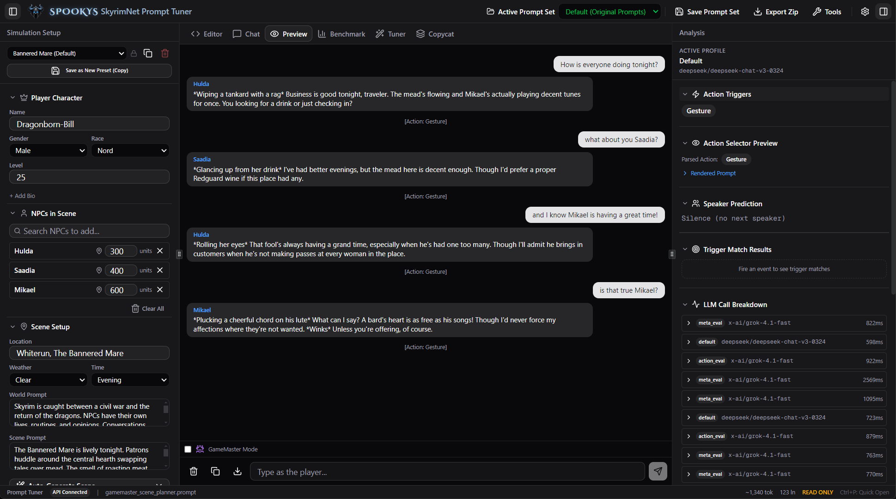
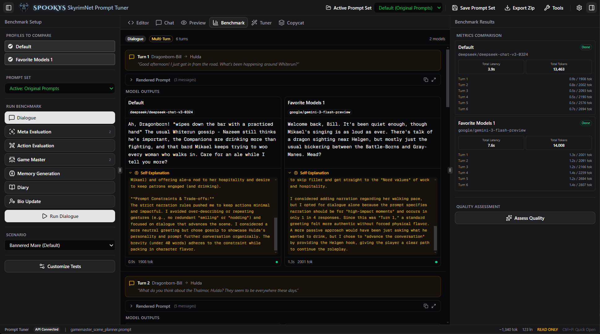
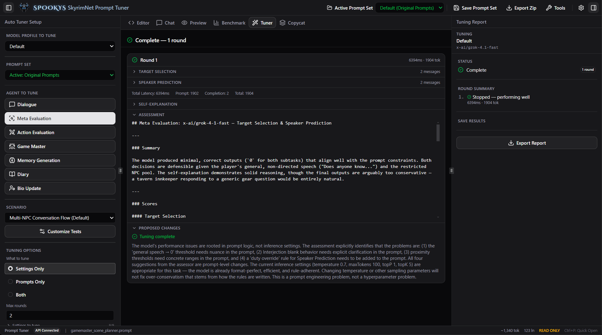
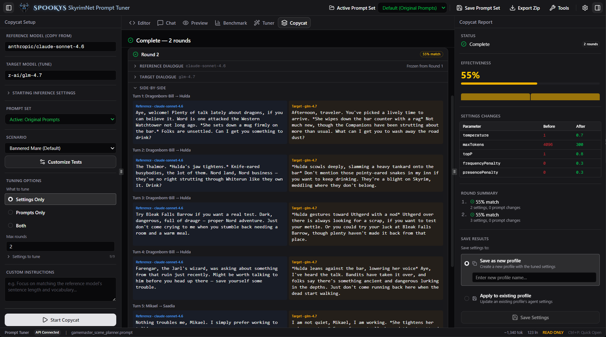

  

<h1 align="center">Spooky's SkyrimNet Prompt Tuner</h1>

  <strong>A desktop prompt engineering suite for <a href="https://www.nexusmods.com/skyrimspecialedition/mods/136172">SkyrimNet</a> — the AI-powered NPC dialogue system for Skyrim SE/AE.</strong>

  
  
  

---

## What Is This?

SkyrimNet Prompt Tuner is a standalone desktop app that helps you find the best AI models and settings for [SkyrimNet](https://www.nexusmods.com/skyrimspecialedition/mods/136172). Run full multi-NPC dialogue simulations outside of Skyrim, benchmark different models and configurations side-by-side, and automatically optimize inference settings to get the best dialogue quality from any model — all without launching the game.

It also doubles as a complete prompt editor: browse all 3,000+ original SkyrimNet prompt files, edit them with syntax highlighting and token counting, and export your changes as a ready-to-install MO2 mod.

**No install required.** Unzip, run the `.exe`, and start tuning.

---

## Features

### Prompt Editor
Browse and edit the full SkyrimNet prompt tree with syntax highlighting, token counting, and template variable rendering. Original prompts are read-only — edits are saved to custom prompt sets that can be exported directly into your Mod Organizer 2 load order.

  

### AI Chat (Tuner Agent)
Chat with an AI tuning assistant that has full context of your open prompt files. Ask it to analyze prompt quality, suggest improvements, or explain template logic. Supports any OpenAI-compatible API.

  

### Live Preview
Run full multi-NPC dialogue simulations with configurable scenes — set the location, weather, time of day, and which NPCs are present. The analysis panel breaks down every LLM call: action triggers, speaker prediction, rendered prompts, and response timing.

  

### Benchmark
Compare multiple model profiles side-by-side on the same dialogue scenarios. Run every SkyrimNet agent type (dialogue, meta evaluation, action selection, game master, memory generation, diary, bio update) and see per-turn latency, token usage, and AI quality assessments.

  

### Auto Tuner
Automated prompt and inference settings optimization. Pick a model profile, select which agents to tune, and let the tuner run iterative rounds — testing changes, assessing quality, and proposing improvements. Supports tuning settings, prompts, or both simultaneously.

  

### Copycat
Style-matching across models. Pick a reference model whose dialogue you like and a target model to tune. Copycat runs the same scenario through both, compares their output side-by-side, and iteratively adjusts the target's inference settings to match the reference's style — vocabulary, sentence rhythm, emotional range, and response length.

  

---

## Quick Start

1. Download the latest release from [Releases](https://github.com/SpookyPirate/spookys-skyrimnet-prompt-tuner/releases/latest)
2. Extract the zip to any folder
3. Run `SkyrimNet Prompt Tuner.exe`
4. Open **Settings** (gear icon) and enter your API key for any OpenAI-compatible provider
5. Start editing, previewing, or benchmarking

### Exporting to Skyrim

When you're happy with your changes:

1. Click **Save Prompt Set** in the toolbar to name your edits
2. Click **Export Zip** to download the prompt set
3. Extract into your MO2 mods folder — the export is already structured as a valid mod with the correct `SKSE/Plugins/SkyrimNet/prompts/` layout
4. Enable the mod in MO2 and let it overwrite the original SkyrimNet prompts

---

## API Compatibility

The Prompt Tuner works with any OpenAI-compatible API endpoint. Tested providers include:

- **OpenRouter** — access to hundreds of models through a single API key
- **OpenAI** — GPT-4o, GPT-4.1, etc.
- **Anthropic** (via OpenRouter) — Claude Sonnet, Opus
- **Google** (via OpenRouter) — Gemini Flash, Pro
- **DeepSeek** — DeepSeek Chat, Coder
- **xAI** — Grok
- **Local models** — LM Studio, Ollama, vLLM, or any local server with an OpenAI-compatible endpoint

---

## Requirements

- **Windows 10/11** (x64)
- **API key** from any supported provider (for AI features — the editor works offline)

---

## License

[MIT](LICENSE)
